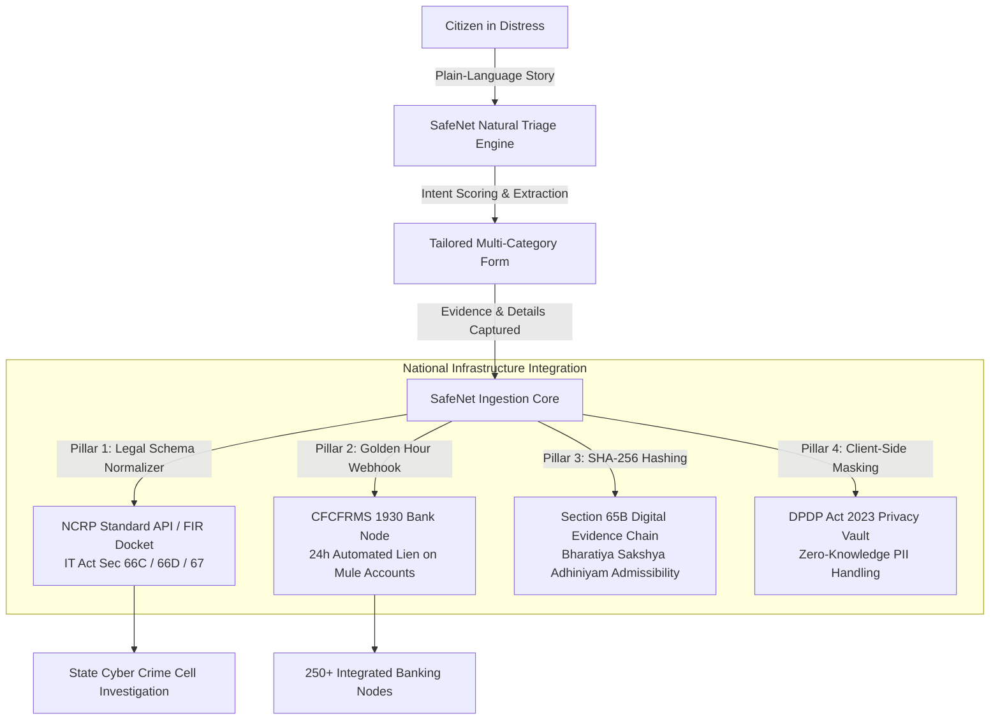

# ✦ SafeNet India
> **A simpler, citizen-first redesign for the National Cyber Crime Reporting Portal.**

[](https://nextjs.org/)
[](https://react.dev/)
[](https://www.typescriptlang.org/)
[](https://www.framer.com/motion/)
[]()

---

## 🎯 The Core Idea

> **Citizens in distress should not have to understand 20+ legal cybercrime categories before they can explain what happened.**

SafeNet India reimagines citizen intake for cybercrime reporting by flipping the legacy paradigm:

- **Legacy Model**: *Category-First* ➔ Confusing dropdowns with overlapping legal classifications (Sec 66D, unauthorized debit, vishing) leading to high friction and abandonment.
- **SafeNet Model**: *Experience-First* ➔ Citizens describe what happened in everyday plain language; on-device assistive triage organizes the right evidence and routes the report automatically.

---

## 🏗️ End-to-End System Architecture

SafeNet is engineered not just as a frontend redesign, but as an **intelligent ingestion and orchestration layer** that bridges citizen experience with India's national law enforcement infrastructure.



### 🏛️ The 4 Architectural Pillars

1. **Legal Schema & Section Mapper (NCRP REST API)**
   - Normalizes unstructured natural language narratives into standardized NCRP JSON complaint payloads.
   - Automatically maps offences to appropriate IT Act sections (e.g. *Sec 66C* for identity theft, *Sec 66D* for cheating by personation, *Sec 67* for offensive content) so legacy police docket software requires **zero modifications**.

2. **"Golden Hour" Automated Bank Lien (CFCFRMS / 1930)**
   - In payment fraud, stolen funds circulate through multiple mule accounts within minutes.
   - SafeNet validates transaction UTRs / UPI Reference numbers and pushes an automated pre-alert to the **Citizen Financial Cyber Fraud Reporting and Management System (CFCFRMS)** API, triggering a temporary 24h lien before manual police processing delays.

3. **Section 65B Cryptographic Evidence Chain (BSA Compliance)**
   - Uploaded screenshots, chat exports, and audio recordings are client-side hashed with **SHA-256** and signed with an ISO-8601 timestamp certificate.
   - Ensures digital evidence is tamper-evident and immediately admissible in Indian courts under Section 65B of the Indian Evidence Act / Bharatiya Sakshya Adhiniyam.

4. **Zero-Knowledge Ephemeral Intake (DPDP Act 2023)**
   - Sensitive citizen identifiers (Aadhaar, debit card numbers, OTPs) are masked on-device before transmission.
   - Ensures strict compliance with India's Digital Personal Data Protection Act 2023.

---

## ✨ Key Features

- **🗣️ Natural-Language Triage Engine**: Intelligent, on-device intent classifier that scores signals across *Financial Fraud*, *Account Takeover*, and *Online Harassment*.
- **⚡ Seamless Handoff & Auto-Advance**: Never asks the same question twice. Story inputs from triage carry over directly into tailored detail collection forms.
- **🛡️ 3 Multi-Category Reporting Journeys**:
  - **💸 Payment & Banking Fraud**: UPI, unauthorized debits, transaction UTR tracking, debit SMS evidence, and immediate **1930 / Bank Freezing** guidance.
  - **🔐 Account & Identity Takeover**: Compromised Instagram, WhatsApp, or Gmail logins, altered recovery credentials, and formal takeover recovery drafts.
  - **🛡️ Online Harassment & Impersonation**: Fake profiles, abusive DMs, timestamped uncropped evidence, and platform Grievance Officer takedown drafts.
- **🚨 High-Contrast Emergency Guidance**: Instant, 1-tap dialer for the national **1930** cyber fraud helpline.
- **🌐 Bilingual by Design**: Full English & हिंदी toggle across all journeys.
- **🔒 100% Client-Side & Private**: All classification and complaint drafting run strictly locally on the citizen's device.

---

## 🚀 Quick Start

### 1. Clone & Install
```bash
git clone https://github.com/<your-username>/cyber-crime-portal-redesign.git
cd cyber-crime-portal-redesign
npm install
```

### 2. Run Locally
```bash
npm run dev
```

Open [http://localhost:3000](http://localhost:3000) (or `http://localhost:3001`) in your browser.

---

## 🛠️ Tech Stack

- **Framework**: Next.js (App Router, Turbopack)
- **Language**: TypeScript
- **Styling**: Vanilla CSS (Custom dark cyber design system with CSS custom properties)
- **Animations**: Framer Motion
- **Architecture**: Modular, zero-server-dependency client prototype

---

## 📄 License

MIT © 2026 SafeNet India Prototype
